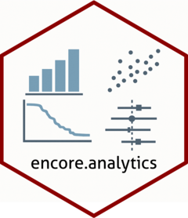

<!-- README.md is generated from README.Rmd. Please edit that file -->

```{r, include = FALSE}
knitr::opts_chunk$set(
  collapse = TRUE,
  comment = "#>",
  fig.path = "man/figures/README-",
  out.width = "100%"
)
```

# encore.analytics 

<!-- badges: start -->
[](https://github.com/janickweberpals/encore.analytics/actions/workflows/R-CMD-check.yaml)
[](https://github.com/janickweberpals/encore.analytics/actions/workflows/pkgdown.yaml)
[](https://app.codecov.io/gh/janickweberpals/encore.analytics?branch=main)
[](https://lifecycle.r-lib.org/articles/stages.html#experimental)
[](https://CRAN.R-project.org/package=encore.analytics)
<!-- badges: end -->

The goal of encore.analytics is to ...

## Installation

You can install the development version of encore.analytics from [GitHub](https://github.com/) with:

``` r
# install.packages("pak")
pak::pak("janickweberpals/encore.analytics")
```

## Example

For a comprehensive walkthrough and examples, please refer to the [vignette](https://janickweberpals.github.io/imputation-ps-workflows/) at:

<https://janickweberpals.github.io/imputation-ps-workflows/>

