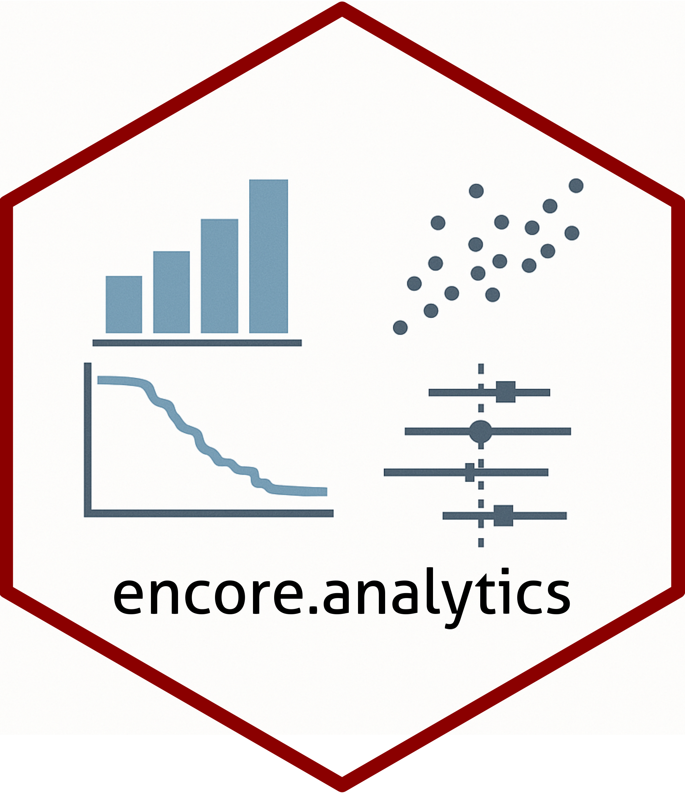

<!-- README.md is generated from README.Rmd. Please edit that file -->

# encore.analytics 

<!-- badges: start -->

[](https://github.com/janickweberpals/encore.analytics/actions/workflows/R-CMD-check.yaml)

<!-- badges: end -->

The goal of encore.analytics is to …

## Installation

You can install the development version of encore.analytics from
[GitHub](https://github.com/) with:

``` r
# install.packages("pak")
pak::pak("janickweberpals/encore.analytics")
```

## Example

This is a basic example which shows you how to solve a common problem:

``` r
library(encore.analytics)
## basic example code
```
